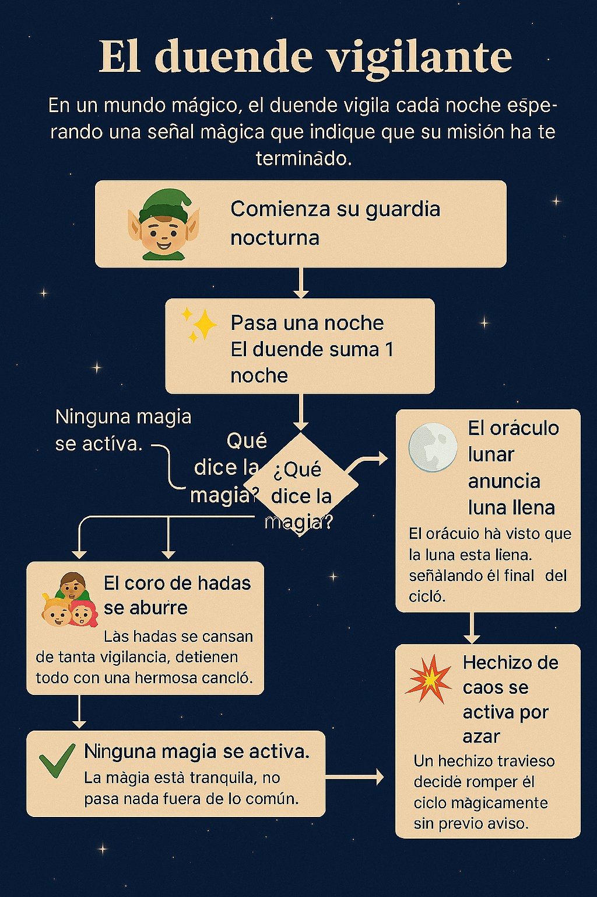

## ✨ Pensamiento Creativo con IA | Javascript con Inteligencia Artificial. 

---

### Indice: 
[1.-Informe de reflexión: Descripción del problema de Javascript elegido.](#-requisitos-de-entrega)

[2.-Evidencia de prompts](#evidencia-de-prompts)

[Fase 1](#fase-1---identificación-y-pensamiento-divergente)

[Fase 2](#fase-2---desarrollo-y-desafío-del-sesgoescoge-la-idea-más-original)

[3.-Analsis de Optimizacion](#análisis-de-optimización)

[4.-Conclucion](#conclusión)

[5.-Codigo final](#código-final)

[6.-Recurso visual](#recurso-visual)

## 📦 Requisitos de entrega

#### Informe de reflexión (Documento de texto): Descripción del problema de Javascript elegido.

🌙✨ Descripción del problema: El duende vigilante y el ciclo mágico. 

Este problema es una forma creativa de entender el bucle while, que repite acciones mientras se cumpla una condición. En lugar de usar estructuras convencionales como let o if, usamos funciones mágicas que deciden cuándo terminar el ciclo.

En un bosque encantado, un duende tiene la misión de vigilar cada noche esperando señales mágicas que le indiquen cuándo puede comenzar un ritual lunar. Cada noche que pasa, el duende suma una al contador. Sin embargo, hay tres fuerzas mágicas que pueden interrumpir su vigilancia:
- 🔮 El Oráculo Lunar: predice cuándo la luna estará llena. Si llega la noche número 5, el oráculo anuncia que la luna está lista y el ritual puede comenzar.
- 🧚 El Coro de Hadas: si se aburren de ver al duende hacer lo mismo por muchas noches (más de 2), cantan una melodía brillante que detiene todo.
- 💥 El Hechizo de Caos: una magia traviesa que puede activarse en cualquier momento si el número de noches es múltiplo de 7, rompiendo el ciclo sin previo aviso.
El duende repite su vigilancia cada noche mientras ninguna de estas magias se active. El ciclo termina cuando cualquiera de las tres señales mágicas aparece

---

## Evidencia de prompts. 
#### Incluye capturas de pantalla o transcripciones de las interacciones clave con la IA que muestren el pensamiento divergente y el desafío al sesgo (Fases 1 y 2).

### Fase 1 - Identificación y pensamiento divergente	

Elige un concepto que sea difícil para ti de Javascript (funciones, promesas, arreglos, etc.). Pide a la IA soluciones que combinen este concepto con un tema no relacionado (música, arte, deportes) para crear un snippet único.

#### **PROMPT** 
"¡Hola! Estoy aprendiendo JavaScript y el tema de bucles sobre ciclo for, y while se me hacen algo complejos. Dame varias soluciones que se combinen con el tema del mundo feerico ya que me gusta mucho y quizá pueda entender mejor el tema. Explica cada caso y se conciso." 

#### **Respuesta:**
¡Perfecto, Damara! Vamos a convertir los bucles en pequeños hechizos del mundo feérico para que te resulten más intuitivos. Te doy ejemplos cortos, explicados y con un toque mágico.

✨ 1. Ciclo for: Contando luciérnagas mágicas
Imagina que una hada quiere contar cuántas luciérnagas brillan en un claro del bosque.

for (let i = 1; i <= 5; i++) {
  console.log("Luciérnaga número " + i);
}

🧚 Explicación
- i = 1 → La hada empieza a contar desde la primera luciérnaga.
- i <= 5 → Solo hay 5 luciérnagas en el claro.
- i++ → Cada vez que la hada cuenta una, pasa a la siguiente.
Resultado: Se imprime del 1 al 5, como si la hada estuviera contando lucecitas.

🌙 2. Ciclo while: Un duende vigilando la luna
Un duende espera a que la luna esté llena para comenzar un ritual. Mientras no lo esté, sigue esperando.

let lunaLlena = false;
let noches = 0;

while (!lunaLlena) {
  noches++;
  console.log("Noche " + noches + ": el duende sigue esperando...");
  
  if (noches === 3) {
    lunaLlena = true; // A la tercera noche, la luna se llena
  }
}

🧝 Explicación
- while (!lunaLlena) → El duende sigue esperando mientras la luna NO esté llena.
- Cada vuelta del bucle es una noche que pasa.
- Cuando llega la tercera noche, la luna se llena y el bucle termina

### Fase 2 - Desarrollo y desafío del sesgo	Escoge la idea más original. 

Pide a la IA que te sugiera una solución que rompa con la práctica estándar (p.ej: resolver un problema de array sin usar map() o usar callbacks en lugar de async/await en un escenario específico). Crea el código basado en este enfoque "prohibido".

#### **PROMPT** 
"Sobre el punto 2 de Ciclo while: Un duende vigilando la luna, me gusta la idea, sugiéreme una solución a ese código pero que rompa con la practica estándar por ejemplo no usar let o if y créame el código (no tan convencional) explicado y que pueda entenderte. No olvides que seguimos con el tema feérico para que pueda entenderte."

#### **Respuesta:** 

¡Me encanta cuando quieres romper las reglas del bosque encantado, Damara! Vamos a llevar esta idea a un nivel más profundo del bosque feérico.
Haremos un código más largo, sin usar let ni if, y con varias salidas creativas del bucle.
Usaremos funciones, objetos mutables, operadores lógicos y hasta un pequeño “coro de hadas” que decide cuándo termina todo

Aquí usaremos const, un truco con funciones y un pequeño hechizo lógico para evitar el if. 

🌙🧝‍♂️ El duende, el oráculo y el coro de hadas
En esta historia:
- El duende cuenta noches.
- El oráculo lunar predice cuándo la luna estará llena.
- Un coro de hadas puede interrumpir el ritual si se aburren.
- Un hechizo de caos puede romper el ciclo por azar.
Todo sin let, sin if y sin estructuras convencionales

// Cofre de estado (sin let)
const estado = {
  noches: 0,
  aburrimientoHadas: 0,
  caos: 0
};

// Oráculo lunar: la luna se llena en la noche 5
const oraculoLunar = () => estado.noches === 5;

// Coro de hadas: se aburren cuando el contador llega a 3
const coroHadas = () => estado.aburrimientoHadas > 2;

// Hechizo de caos: termina si el número es múltiplo de 7
const hechizoCaos = () => estado.caos % 7 === 0 && estado.caos !== 0;

// Función que incrementa todo sin usar let
const pasarNoche = () => (
  estado.noches++,
  estado.aburrimientoHadas++,
  estado.caos++,
  console.log(`🌙 Noche ${estado.noches}: el duende sigue vigilando...`),
  null
);

// Condición general para seguir el ritual
const continuar = () =>
  !oraculoLunar() &&
  !coroHadas() &&
  !hechizoCaos();

// Bucle while con múltiples condiciones mágicas
while (continuar()) {
  pasarNoche();
}

// Resultado final según qué magia rompió el ciclo
const mensajes = {
  luna: "🌕 El oráculo anuncia que la luna está llena. El ritual comienza.",
  hadas: "🧚 El coro de hadas se aburrió y detuvo todo con un canto agudo.",
  caos: "💥 Un hechizo de caos explotó y rompió el ciclo inesperadamente."
};

// Selección del mensaje final sin if
console.log(
  mensajes[
    oraculoLunar() ? "luna" :
    coroHadas() ? "hadas" :
    "caos"
  ]
);

🧚‍♀️ Explicación feérica y clara

🌙 1. estado como cofre mutable
Usamos un objeto const para guardar todo: noches, aburrimiento y caos.
No usamos let, pero sí modificamos propiedades internas.

🔮 2. Tres entidades mágicas que pueden detener el ciclo
- Oráculo lunar: la luna se llena en la noche 5.
- Coro de hadas: si se aburren (más de 2 noches), paran todo.
- Hechizo de caos: si el contador de caos es múltiplo de 7, BOOM

🌀 3. pasarNoche()
Una función que:
- Incrementa todos los contadores.
- Imprime el avance.
- No usa let ni if

🧝‍♂️ 4. continuar()
Una función que combina todas las condiciones mágicas usando operadores lógicos.
Mientras ninguna condición de salida se cumpla, el duende sigue.

✨ 5. Mensaje final sin usar if
Usamos un objeto mensajes y un truco con operadores ternarios para elegir el desenlace

---

## Análisis de optimización: 
#### Documenta las dos mejoras sugeridas por la IA y cómo las implementaste

Fase 3	Revisión y refinamiento/evaluación	Utiliza la IA para evaluar tu código de la fase 2. Pídele que identifique legibilidad, funcionamiento, posibles bugs, buenas prácticas y sugiera al menos dos optimizaciones para mejorar la eficiencia o legibilidad. Implementa y documenta estos cambios.

#### **PROMPT** 
"Ahora con ese código se especifico con estos puntos: Identifica legibilidad, funcionamiento, posibles bugs, buenas prácticas y sugiéreme al menos dos optimizaciones para mejorar la eficiencia o legibilidad."

#### **Respuesta:** 
¡Vamos a destripar este hechizo feérico línea por línea, Damara!
Te doy un análisis técnico pero narrado con magia, y luego dos optimizaciones reales para mejorar el código.

✨ 1. Legibilidad
El código es creativo y divertido, pero desde el punto de vista técnico:
✅ Puntos claros
• 	Las funciones (, , ) están bien separadas y son fáciles de entender.
• 	El objeto  centraliza los datos, lo cual ayuda a seguir la historia.
• 	La función  agrupa acciones repetitivas, lo cual mejora la claridad

❌ Puntos que afectan la legibilidad
- El uso de operadores lógicos encadenados para decidir el mensaje final puede ser confuso.
- El uso de comas dentro de pasarNoche() es poco común y puede dificultar la lectura.
- Las condiciones mágicas están dispersas y requieren saltar entre funciones para entender el flujo

🌙 2. Funcionamiento
El bucle while (continuar()) funciona correctamente:
- Se detiene cuando cualquiera de las condiciones mágicas se cumple.
- Las funciones de control devuelven booleanos claros.
- El flujo general es estable y predecible

🐛 3. Posibles bugs
Aquí hay algunos riesgos reales:
⚠️ 1. El hechizo de caos puede activarse en la primera iteración
estado.caos inicia en 0.
La condición es: 
estado.caos % 7 === 0 && estado.caos !== 0

⚠️ 2. El mensaje final depende del orden del operador ternario
Si dos condiciones se cumplen al mismo tiempo (por ejemplo, luna llena y caos), el código siempre elegirá la primera.
Esto puede ser intencional, pero es frágil.
⚠️ 3. El uso de comas en pasarNoche() puede causar errores difíciles de detectar
Si alguien agrega una línea sin entender la sintaxis, puede romper la función

🌿 4. Buenas prácticas presentes
✅ Separación de responsabilidades
✅ Uso de funciones pequeñas
✅ Evitar variables globales sueltas
✅ Uso de constantes para evitar reasignaciones accidentales

🔧 5. Dos optimizaciones recomendadas
✅ Optimización 1: Reemplazar la sintaxis de comas por un bloque normal
Esto mejora la legibilidad y reduce errores

const pasarNoche = () => {
  estado.noches++;
  estado.aburrimientoHadas++;
  estado.caos++;
  console.log(`🌙 Noche ${estado.noches}: el duende sigue vigilando...`);
};

✅ Más legible
✅ Menos propenso a errores
✅ Más estándar para otros desarrolladore

✅ Optimización 2: Centralizar la lógica de finalización
Podemos crear una función que decida el final de forma más clara
const final = () => {
  if (oraculoLunar()) return "luna";
  if (coroHadas()) return "hadas";
  return "caos";
};
console.log(mensajes[final()]);

✅ Más fácil de entender
✅ Más fácil de extender (si agregas más condiciones mágicas)
✅ Reduce la complejidad visual

---

## Conclusión: 
#### Reflexiona sobre cómo el proceso aumentó tu comprensión del concepto de Javascript elegido.

Si creo que me ayudo a comprender un poco mas el tema, creo que lo desmenuzo bien aun que creo que podria haber sido mas especifico en algunos puntos ya que el codigo al inicio no se me hizo facil comprenderlo, si no, hasta el último prompt y la imagen que me enseño, por lo que me si siento que aún en los primeros pasos estuvo un poco más complejo. 
El tema de bucles se men hacía un poco complejo por los puntos a seguir, por ejemplo donde rompia el ciclo y que cosa se imprimia o no en consola pero siento que viendo el ejercio entiendo que en donde este la condicion y el console log o retorno puede ayudarme a identificar que se va a imprimir y como terminar el bucle. 

--- 

## Código Final: 
#### Archivo .js (o snippet de código claro) de la solución funcional, con comentarios.

[Ver main.js](main.js)

---

## Recurso Visual: 
#### El diagrama/esquema generado por IA (formato PNG, SVG o similar).
 